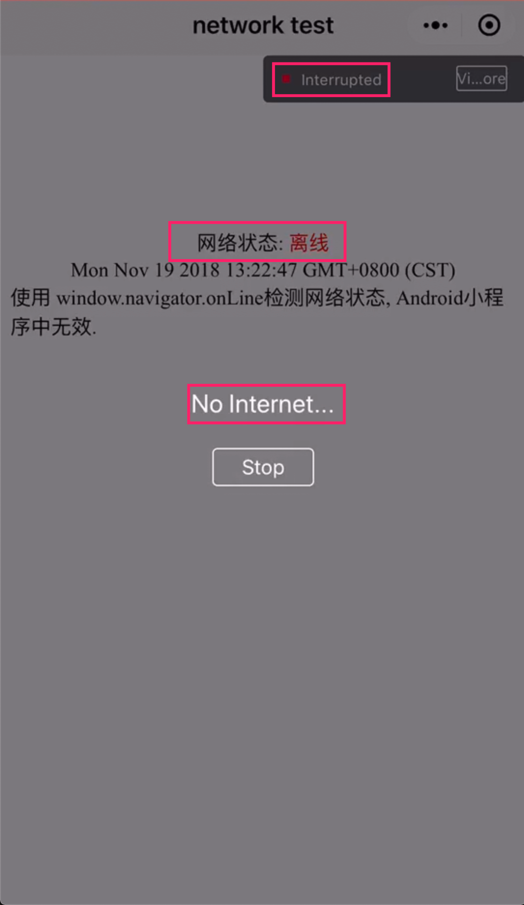
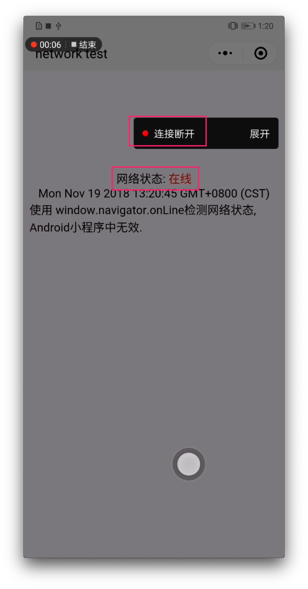

## 小程序 Android 的 webview 的 window.navigator.onLine 无法获取正确的网络状态

bug单: https://developers.weixin.qq.com/community/develop/doc/000c8a157343d04ef1a73e87756c00

## 情况

iOS 正常: 断开网络时 window.navigator.onLine 获取到页面离线


Android 异常: 断开网络时 window.navigator.onLine 无法获取到页面离线


## 复现路径

1. clone 代码到本地
2. 用微信开发者工具导入工程并进行 `真机调试`
3. 在真机上打开小程序
4. 断开手机网络, 观察小程序页面的 `网络状态`

## 测试页面

`./network-test.html`

## 兼容解决方法
[getNetworkStatus.js](./getNetworkStatus.js)

用法:
```
import { getNetworkStatus } from './getNetworkStatus.js';

// 网络状态
let onLine;
getNetworkStatus().then(res => onLine = res);
```

## References

[浏览器离线检测兼容性](https://caniuse.com/#feat=online-status)

## EOF
